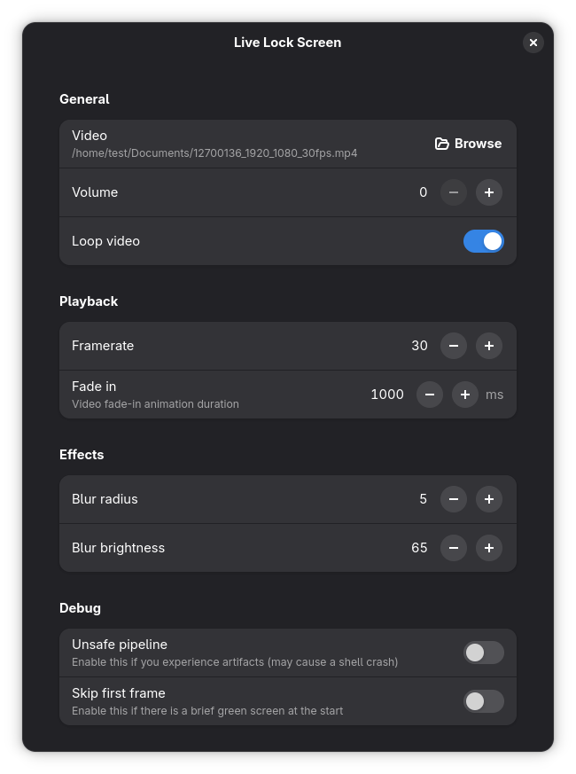
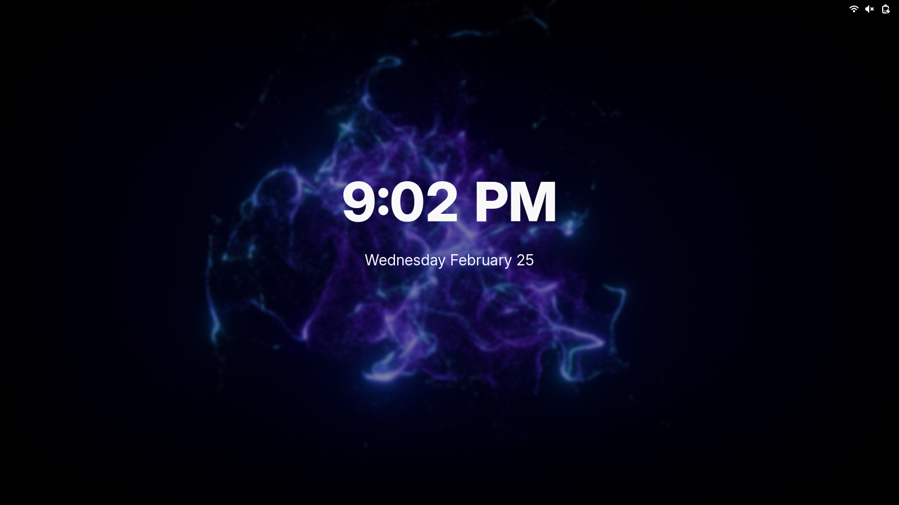
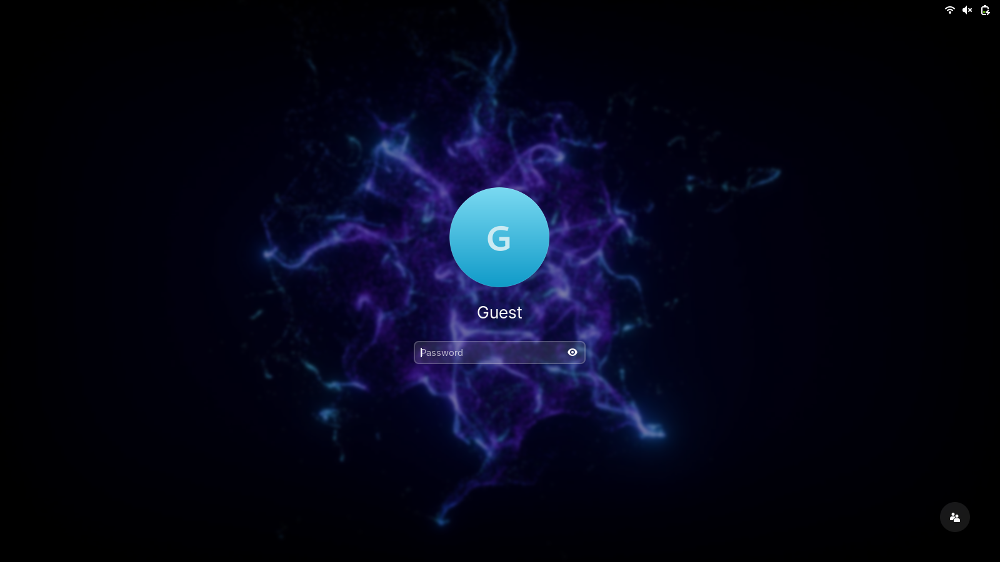

<p align="center">
  
</p>


# Live Lock Screen

A GNOME Shell extension that lets you set any video as your lock screen background.

> ⚠️ Only tested on GNOME 47-49 so far. Should work on GNOME 45+ but not guaranteed. Try at your own risk.

> 💡 If you experience issues, check the **Debug** section in preferences for workarounds.

## Features

- 🎬 Play any video file as the lock screen background
- 🔁 Loop support
- ⏸️ Auto pause/play on suspend/wake
- 🌌 Configurable fade-in animation
- 🖥️ Multiple monitor support (with automatic stretching)
- 🌫️ Blur effect with adjustable radius and brightness
- 🎞️ Configurable framerate (1-120 fps)
- 🔊 Optional audio output with volume control

## Screenshots

<p align="center">
  
  <br><br>
  
  <br><br>
  
</p>

## TODO

- [ ] Test on GNOME 45, 46 — 🚧 in progress
- [ ] Video scaling modes (cover, fit, stretch) — 🚧 in progress
- [ ] Publish to extensions.gnome.org
- [ ] ~~Per-monitor video selection~~ — not planned, single pipeline is used for performance

## Known Issues
- Possible audio and video desync after suspend/wake
- Brief green frame at video start (enable "Skip first frame" in Debug settings to fix or switch to unsafe pipeline)
- Performance issues and shell crashes with high-res videos (hardware dependent)

## Installation

### Manual

1. Clone the repository:
   ```bash
   git clone https://github.com/nick-redwill/LiveLockScreen.git
   ```

2. Copy to your extensions folder:
   ```bash
   cp -r LiveLockScreen ~/.local/share/gnome-shell/extensions/live-lockscreen@nick-redwill
   ```

3. Log out and back in, then enable the extension:
   ```bash
   gnome-extensions enable live-lockscreen@nick-redwill
   ```

4. Open the extension preferences and select your video file.

## Requirements

- GNOME Shell 47-49 (other versions untested)
- GStreamer with good/bad plugins:
  ```bash
  # Fedora
  sudo dnf install gstreamer1-plugins-good gstreamer1-plugins-bad-free gstreamer1-plugins-ugly
  
  # Ubuntu/Debian
  sudo apt install gstreamer1.0-plugins-good gstreamer1.0-plugins-bad gstreamer1.0-plugins-ugly
  ```

## License

AGPL-3.0
